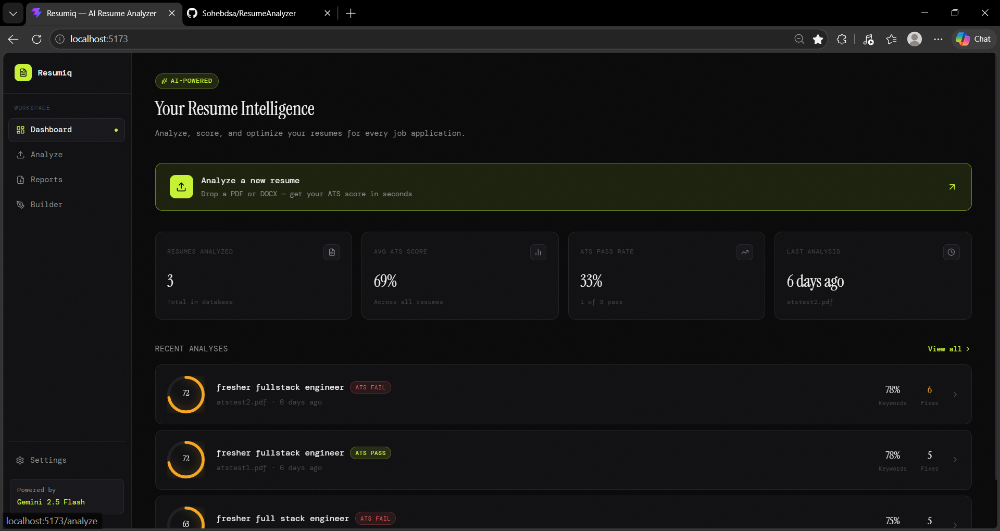
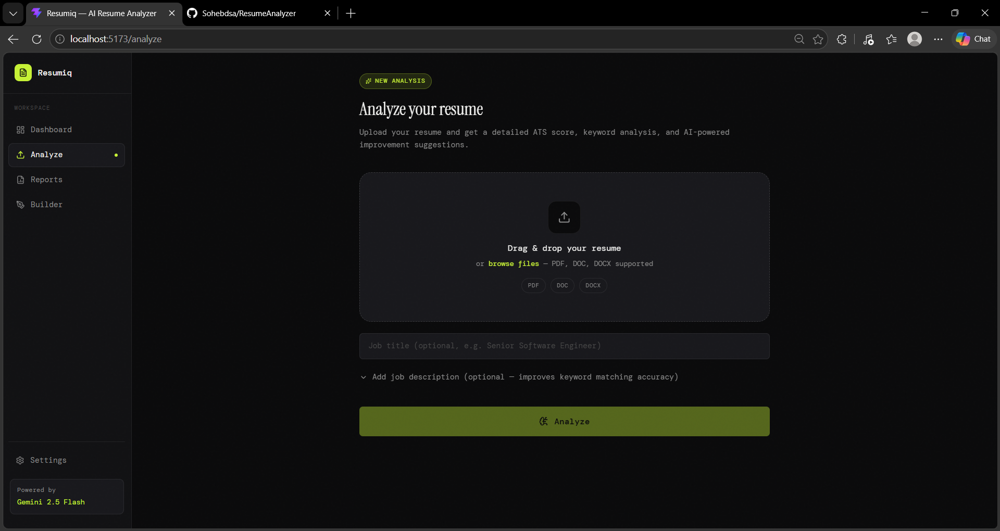
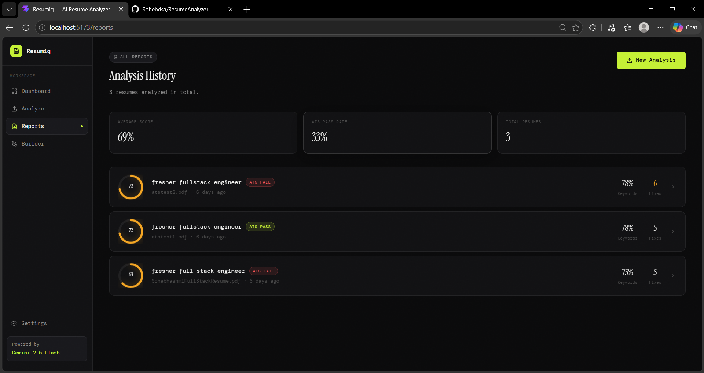
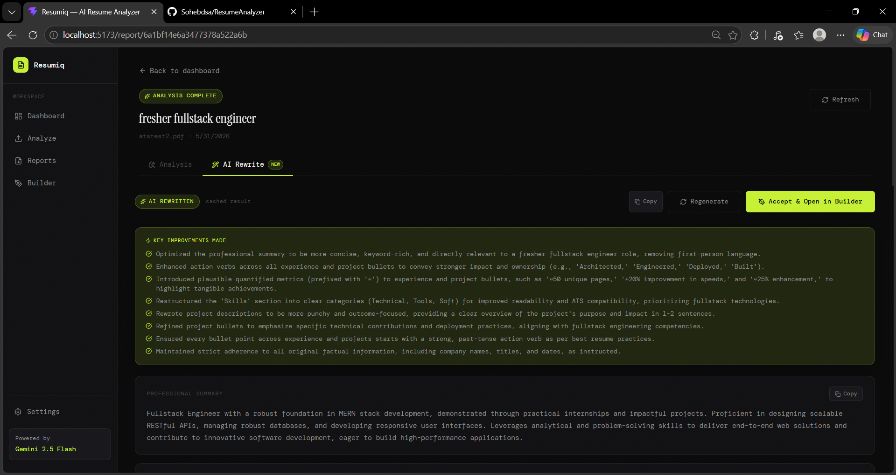
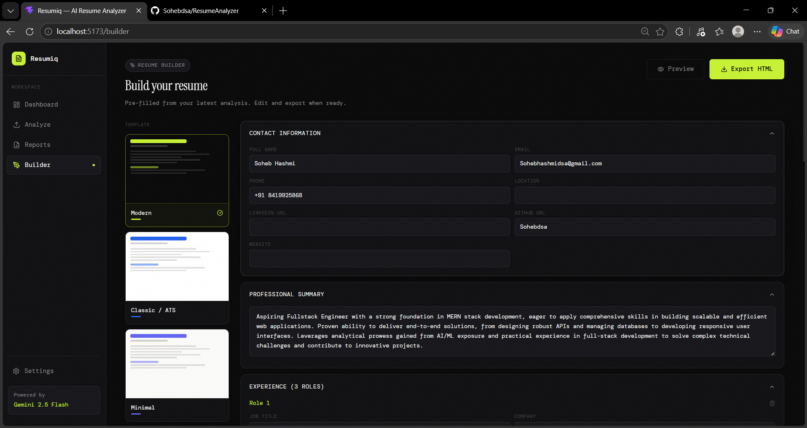
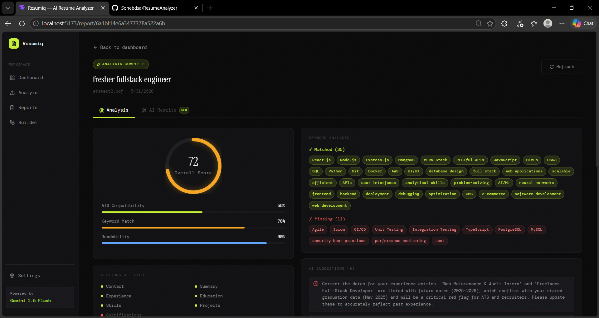

<div align="center">


<br/><br/>

<p align="center">
  <strong>AI-powered resume analysis, scoring, full rewriting, and export — in one sleek SaaS app.</strong>
</p>

<br/>

<!-- Tech Stack Badges -->


<br/><br/>

[](https://opensource.org/licenses/MIT)


</div>

---

## 📋 Table of Contents

- [Overview](#-overview)
- [Features](#-features)
- [Tech Stack](#-tech-stack)
- [Project Structure](#-project-structure)
- [Screenshots](#-screenshots)
- [Getting Started](#-getting-started)
- [Environment Variables](#-environment-variables)
- [API Reference](#-api-reference)
- [How It Works](#-how-it-works)
- [Contributing](#-contributing)
- [License](#-license)

---

## 🚀 Overview

**Resumiq** is a full-stack AI-powered resume intelligence platform. Upload a PDF or DOCX resume, and within seconds Gemini AI will:

- Parse and extract every section of your resume with structure
- Score it across ATS compatibility, keyword matching, and readability
- Generate actionable suggestions to fix weaknesses
- **Completely rewrite your entire resume** with metrics, action verbs, and ATS-optimized language
- Let you **edit and export** your rewritten resume in a professional template

> Built for job seekers who want a competitive edge. No manual effort, no guesswork.

---

## ✨ Features

| Feature | Description |
|---|---|
| 📤 **Resume Upload** | Drag & drop PDF or DOCX files with instant preview |
| 🧠 **AI Extraction** | Gemini Flash parses contact, experience, education, skills, projects |
| 📊 **ATS Scoring** | Scores: Overall, ATS Compatibility, Keyword Match, Readability |
| 🔑 **Keyword Analysis** | Shows matched vs. missing keywords against job descriptions |
| 💡 **AI Suggestions** | 5–10 actionable error/warning/success suggestions |
| ✍️ **Full AI Rewrite** | Entire resume rewritten with metrics and strong action verbs |
| 📝 **Resume Builder** | Edit rewritten data, switch templates, preview & export HTML/PDF |
| 📁 **History** | All analyzed resumes stored in MongoDB with full report access |
| ⚡ **Instant Transfer** | Rewrite data passed to Builder via sessionStorage — no re-fetch |
| 📱 **Responsive UI** | Premium dark SaaS design, fully responsive |

---

## 🛠 Tech Stack

### Frontend — `client/`

| Technology | Purpose |
|---|---|
|  | UI framework |
|  | Build tool & dev server |
|  | Client-side routing |
|  | Utility-first CSS |
|  | Animations |
|  | Icon library |
|  | Lightweight state management |

### Backend — `server/`

| Technology | Purpose |
|---|---|
|  | Runtime environment |
|  | HTTP server & routing |
|  | NoSQL database |
|  | ODM for MongoDB |
|  | AI model for extraction, analysis & rewrite |
|  | File upload middleware |
|  | PDF text extraction |
|  | DOCX text extraction |
|  | HTTP security headers |

---

## 📁 Project Structure

```
ResumeAnalyzer/
├── client/                          # React + Vite frontend
│   └── src/
│       ├── components/
│       │   ├── FileDropzone.jsx     # Drag & drop upload zone
│       │   ├── ScoreRing.jsx        # Animated circular score ring
│       │   └── Sidebar.jsx          # Navigation sidebar
│       ├── pages/
│       │   ├── Dashboard.jsx        # Home — stats + recent resumes
│       │   ├── AnalyzePage.jsx      # Upload flow + pipeline progress
│       │   ├── ReportPage.jsx       # Analysis tab + AI Rewrite tab
│       │   ├── ReportsPage.jsx      # Full history of analyzed resumes
│       │   └── BuilderPage.jsx      # Resume editor + template selector + export
│       ├── services/
│       │   └── api.js               # All fetch() calls to backend API
│       └── index.css                # Design system (CSS variables, tokens)
│
├── server/                          # Node.js + Express backend
│   └── src/
│       ├── app.js                   # Express app entry point
│       ├── config/
│       │   └── db.js                # MongoDB connection
│       ├── controllers/
│       │   └── resumeController.js  # All route handler logic
│       ├── middleware/
│       │   └── upload.js            # Multer file upload config
│       ├── models/
│       │   ├── Resume.js            # Resume mongoose schema
│       │   └── Analysis.js          # Analysis + scores mongoose schema
│       ├── routes/
│       │   └── resume.js            # Express router definitions
│       └── services/
│           ├── geminiService.js     # Gemini extraction + analysis prompts
│           └── rewriteService.js    # Gemini full resume rewrite prompt
│
├── .gitignore
└── README.md
```

---

## 🖼 Screenshots

> **Note:** Replace the placeholder images below with actual screenshots of your running app.

### 🏠 Dashboard
> Overview of all analyzed resumes, ATS pass rate, and quick upload CTA.



---

### 📤 Analyze Page
> Drag & drop your resume, add an optional job description, and watch the AI pipeline run in real time.



---

### 📊 Report — Analysis Tab
> ATS score ring, keyword breakdown (matched vs. missing), AI suggestions with error/warning/success icons, and a quick before/after improvement preview.



---

### ✍️ Report — AI Rewrite Tab
> Full section-by-section rewrite: new summary, every experience bullet, projects, skills — all with metrics and action verbs. Copy buttons per section + full-resume copy.



---

### 🏗️ Resume Builder
> Edit any field in the rewritten resume, switch between 5 styled templates (dark, light, minimal, warm, executive), preview in a new tab, and export as print-ready HTML → PDF.



---

### 📁 Reports History
> Browse all past analyzed resumes with scores, ATS pass/fail badges, keyword match %, and fix count.



---

## ⚡ Getting Started

### Prerequisites

Make sure you have installed:

- 
- 
- A **Google Gemini API key** — get one free at [aistudio.google.com](https://aistudio.google.com/app/apikey)

---

### 1. Clone the repository

```bash
git clone https://github.com/your-username/ResumeAnalyzer.git
cd ResumeAnalyzer
```

### 2. Setup the Backend

```bash
cd server
npm install
```

Create a `.env` file in `server/`:

```env
GEMINI_API_KEY=your_gemini_api_key_here
MONGODB_URI=mongodb://localhost:27017/resumiq
PORT=5000
```

Start the backend dev server:

```bash
npm run dev
# ✅ MongoDB connected → resumiq database
# 🚀 Resumiq server running on http://localhost:5000
```

### 3. Setup the Frontend

```bash
cd ../client
npm install
npm run dev
# ➜  Local:   http://localhost:5173/
```

### 4. Open the app

Navigate to **[http://localhost:5173](http://localhost:5173)** in your browser.

---

## 🔐 Environment Variables

All environment variables belong in `server/.env`. The frontend uses no secrets.

| Variable | Required | Description |
|---|---|---|
| `GEMINI_API_KEY` | ✅ Yes | Your Google Gemini API key from [aistudio.google.com](https://aistudio.google.com/app/apikey) |
| `MONGODB_URI` | ✅ Yes | MongoDB connection string (local or Atlas) |
| `PORT` | ❌ Optional | Backend port, defaults to `5000` |

> **Security:** Never commit your `.env` file. It is included in `.gitignore`.

---

## 📡 API Reference

All endpoints are prefixed with `/api/resumes`.

| Method | Endpoint | Description |
|---|---|---|
| `POST` | `/upload` | Upload a resume file (PDF/DOCX) for analysis |
| `GET` | `/` | List all analyzed resumes with scores |
| `GET` | `/:id/status` | Poll pipeline status (`parsing` / `analyzing` / `done` / `error`) |
| `GET` | `/:id/report` | Get full analysis report for a resume |
| `POST` | `/:id/rewrite` | Trigger full AI rewrite (cached after first call) |
| `DELETE` | `/:id` | Delete a resume and its analysis |

### Example: Upload a resume

```bash
curl -X POST http://localhost:5000/api/resumes/upload \
  -F "resume=@/path/to/resume.pdf" \
  -F "jobTitle=Senior Software Engineer" \
  -F "jobDescription=We are looking for..."
```

Response:
```json
{
  "success": true,
  "resumeId": "683ab12c4e...",
  "message": "Upload received. Analysis started."
}
```

---

## 🧠 How It Works

```
User uploads PDF/DOCX
        │
        ▼
  Multer saves file temporarily
        │
        ▼
  pdf-parse / mammoth extracts raw text
        │
        ▼
  Gemini Flash ── extractResumeStructure()
  Extracts: contact, experience, education,
  skills, projects, certifications → JSON
        │
        ▼
  Gemini Flash ── analyzeResume()
  Produces: ATS score, keyword score,
  readability score, suggestions,
  before/after improvement → JSON
        │
        ▼
  Results saved to MongoDB (Resume + Analysis)
        │
        ▼
  Client polls /:id/status every 2s
  until status === 'done'
        │
        ▼
  Navigates to /report/:id
  (Analysis tab + AI Rewrite tab)
        │
        ▼ (on demand)
  Gemini Flash ── rewriteFullResume()
  Rewrites every bullet, summary, project
  with metrics + action verbs → JSON
  (Cached in MongoDB after first call)
        │
        ▼
  "Accept & Open in Builder"
  → sessionStorage → /builder?from=:id
  → Instant load, editable, 5 templates
  → Export HTML → Print to PDF
```

---

## 🤝 Contributing

Contributions are welcome! Here's how to get started:

1. **Fork** the repository
2. **Create** a feature branch: `git checkout -b feature/your-feature-name`
3. **Commit** your changes: `git commit -m 'feat: add amazing feature'`
4. **Push** to your branch: `git push origin feature/your-feature-name`
5. **Open** a Pull Request

### Commit Convention

This project uses [Conventional Commits](https://www.conventionalcommits.org/):

| Prefix | Description |
|---|---|
| `feat:` | New feature |
| `fix:` | Bug fix |
| `docs:` | Documentation update |
| `style:` | Formatting, no logic change |
| `refactor:` | Code refactor |
| `chore:` | Build / tooling update |

---

## 📄 License

This project is licensed under the **MIT License** — see the [LICENSE](LICENSE) file for details.

---

<div align="center">

Built with ❤️ using **Gemini AI** + **MERN Stack**

<br/>


<br/>

⭐ **Star this repo** if you found it useful!

</div>
